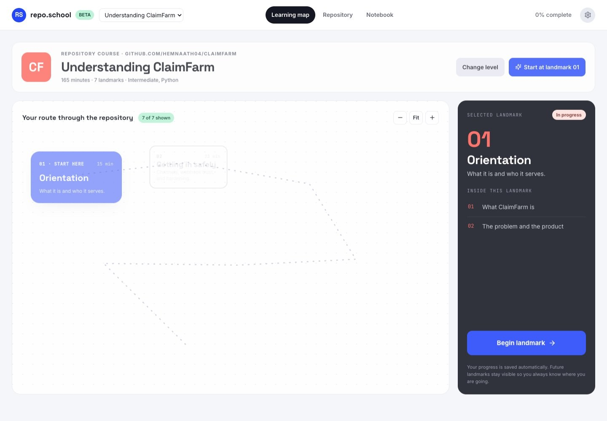
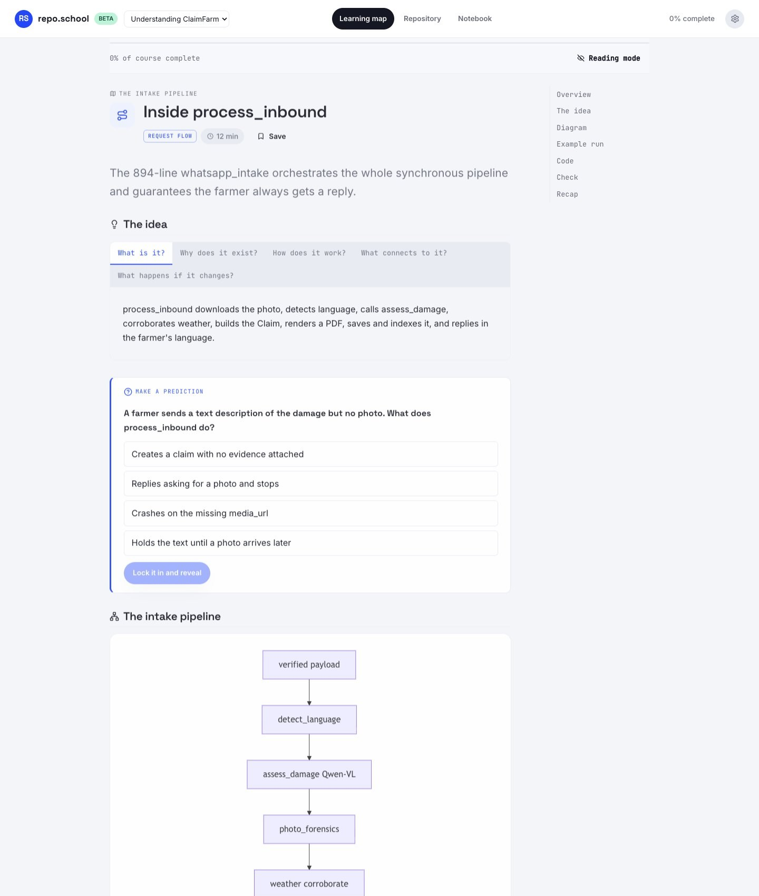
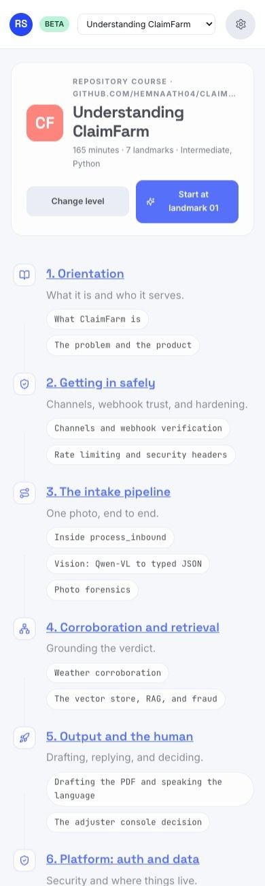

# repo-learning-builder

A [Claude Code](https://claude.com/claude-code) skill that turns **anything you want to understand** into an interactive learning web app in the permanent **Atlas** design: a codebase, a GitHub URL, a topic, a single source file, or a set of docs.

One reusable app hosts many courses. Each run generates only **compact course JSON**, never new UI, so courses are fast, cheap, and consistent to produce, and it works with small **Haiku-class** models by generating one lesson at a time against a strict schema.



| Lesson | Mobile |
| --- | --- |
|  |  |

## Learn literally anything

If you can point at it or name it, it can become a course:

```
/repo-learning-builder https://github.com/owner/repo        # a whole codebase
/repo-learning-builder teach me DNS                          # any topic
/repo-learning-builder teach me how transformers work        # any concept
/repo-learning-builder teach me auth from this project       # one theme inside a repo
/repo-learning-builder create a lesson about src/session.ts  # a single file
/repo-learning-builder teach me from ./docs                  # documents you have
```

Repository courses are grounded in the real code: every claim cites a real file, walkthroughs carry real snippets, and the repository explorer maps the actual tree. Topic courses use the same lesson anatomy without the code-specific parts.

## Built to make it stick

Every lesson teaches with evidence and interaction, not walls of text:

- **The five questions**: What is it? Why does it exist? How does it work? What connects to it? What happens if it changes?
- **Make a prediction**: commit to a guess before the mechanism is revealed (never graded).
- **Watch it run**: one real input traced step by step with the live data at each step; press Play and watch changed values flash as they move through the system.
- **What happens if...**: pick an input (including the failure cases) and watch the real branch play out.
- **Analogy maps**: every analogy comes with an "in the story / in this system" table so it never lies.
- **Common misconceptions**: named and corrected before they settle in.
- **Code walkthroughs**: real excerpts with highlighted lines, inputs, outputs, dependencies, and failure paths.
- **Knowledge checks, activities, teach-back prompts**, progress, mastery with spaced repetition, notes, bookmarks, search, and a glossary.
- **Motion that teaches**: pipeline edges carry a visible current, the learning route drifts forward, sections unfold as you read, wrong answers shake, right ones pop. One `prefers-reduced-motion` setting turns it all off.

## How to use it, step by step

### Step 1: install the skill (once)

Option A, the Claude Code plugin marketplace (recommended):

```
/plugin marketplace add hemnaath04/repo-learning-builder
/plugin install repo-learning-builder@hemnaath-skills
```

Update later with `/plugin marketplace update hemnaath-skills` then `/plugin update repo-learning-builder`. Installed as a plugin, invoke it as `/repo-learning-builder:repo-learning-builder`.

Option B, clone into your skills folder (the repo is also a standalone skill, `SKILL.md` at the root):

```bash
git clone https://github.com/hemnaath04/repo-learning-builder \
  ~/.claude/skills/repo-learning-builder
```

Restart Claude Code and invoke it as `/repo-learning-builder`.

### Step 2: point it at what you want to learn

Open Claude Code anywhere and give the skill a source:

```
/repo-learning-builder https://github.com/fastapi/fastapi
```

or a topic, a file, a folder of docs, or "this project" for the repo you are sitting in.

### Step 3: answer four quick questions

It asks one compact questionnaire: your level (ELI10 to advanced), your goal (big picture, understand the code, contribute, present), depth (quick, standard, deep), and style (visual, story, hands-on, code-first). Or just pick **"Use recommended defaults"**.

Deep means deep: it scans the whole codebase and creates one lesson per real subsystem, not a longer README summary.

### Step 4: let it build

The skill fingerprints the source, analyzes it into a compact manifest, plans the course, generates lessons one at a time, validates each one, and repairs anything invalid field by field. You end up with a `course.json`; the app itself is never rebuilt.

### Step 5: open the app and learn

```bash
cd learning-app
npm install      # first time only
npm run dev      # http://localhost:5173
```

Then learn on the map:

1. Start at the **learning atlas**: numbered landmarks connected by a route, one per module. Click landmark 01.
2. Open the first lesson from the dock. Read the five-question **idea** tabs.
3. **Make your prediction** before the mechanism is shown, then reveal.
4. Press **Play** on "Watch it run" and follow one real input through the system.
5. Step through the **code walkthrough** (repo courses) and try the **what if** scenarios, including the failure branches.
6. Take the **knowledge check**, do the five-minute **activity**, and move on. "Complete and continue" tracks your progress.
7. Use the **Repository** view to explore the real file tree, and the **Notebook** to resume, review quiz mistakes, and export notes.

### Step 6: add more courses to the same app

Run the skill again with a new source. Adding a course only writes files under `public/courses/`; the app, its design, and your progress in other courses stay untouched.

```
learning-app/
├── src/                     # permanent Atlas template (never edited to add a course)
├── public/courses/
│   ├── index.json           # generated course registry
│   ├── claimfarm/course.json
│   └── dns/course.json
├── package.json             # permanent
└── package-lock.json        # permanent
```

### Step 7: keep it fresh

When the source repo changes, run the skill again. It re-fingerprints, regenerates only the lessons whose cited files changed, and preserves your progress through stable lesson ids.

## How it stays fast and truthful

Generation is a token-efficient, deterministic-first pipeline (see `references/` and `scripts/`):

1. **Fingerprint** the source (`scripts/fingerprint-source.mjs`); reuse cached analysis when it matches.
2. **Analyze** into a compact `source-manifest.json` (`scripts/analyze-source.mjs`); never dump whole files or secrets.
3. **Scaffold** stable course/module/lesson ids and archetypes (`scripts/create-course-scaffold.mjs`).
4. **Generate one lesson at a time** with the Haiku-friendly prompts in `prompts/`.
5. **Validate** each lesson and **repair field-by-field** (`scripts/validate-lesson.mjs`, `prompts/repair-json.md`).
6. **Assemble** and **register** the course (`scripts/assemble-course.mjs`, `scripts/register-course.mjs`).

Every repository claim cites a real file. Inferences are labeled. The validator also nudges quality: it warns when a lesson has no concrete example or no activity.

## The Atlas design

- A full-width top bar, a compact course identity strip, and a **spatial learning atlas**: landmark cards connected by an SVG path, with a contextual lesson dock.
- Palette: gallery white `#F7F8FC`, ink `#151722`, ultramarine `#2447F9`, coral `#FF6258`, mint `#BDF3D8`, fog `#E8EAF2`. Type: Space Grotesk + Inter.
- Responsive: desktop spatial atlas + right dock, tablet compact atlas + bottom panel, mobile vertical connected journey + bottom sheet with focus trapping.
- Light and dark themes, keyboard navigation, screen-reader landmarks.

## What's in here

```
SKILL.md                     # concise, procedural entry point
prompts/                     # plan-course, generate-lesson, generate-quiz, generate-glossary, repair-json
references/                  # course-schema, teaching-rules, source-analysis
scripts/                     # analyze-source, fingerprint-source, create-course-scaffold,
                             # validate-lesson, assemble-course, register-course, install-template
assets/webapp-template/      # the permanent Atlas React + TS + Vite app (ships two demo courses)
```

Try the app immediately: `cd assets/webapp-template && npm install && npm run dev`. The demo ships two courses, a deep code-grounded one (ClaimFarm) and a quick topic one (DNS), so you can feel both modes.

## License

MIT. See [LICENSE](LICENSE).
